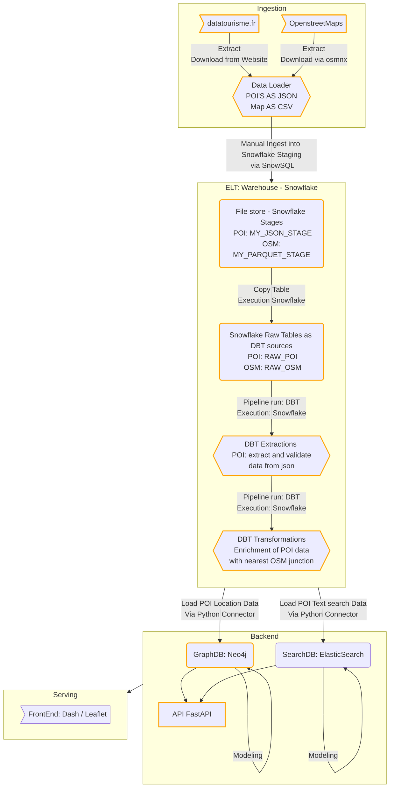
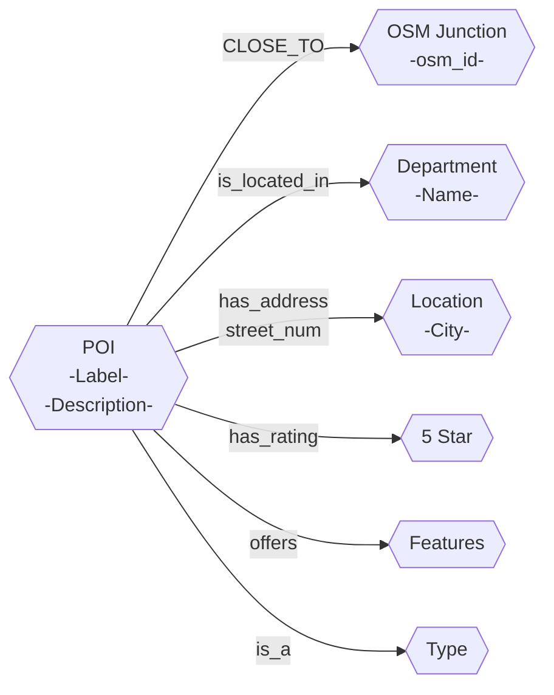

## Prepare Snowflake

### create dbt user in snowflake

- used worksheet in snowflake for executing the queries

```sql
-- Use an admin role
USE ROLE ACCOUNTADMIN;

-- Create the `elt` role
CREATE ROLE IF NOT EXISTS elt;
GRANT ROLE elt TO ROLE ACCOUNTADMIN;

-- Create the default warehouse if necessary
CREATE WAREHOUSE IF NOT EXISTS COMPUTE_WH;
GRANT OPERATE ON WAREHOUSE COMPUTE_WH TO ROLE elt;

-- Create the `dbt` user and assign to role
CREATE USER IF NOT EXISTS dbt
  PASSWORD='<pwd>'
  LOGIN_NAME='<user>'
  MUST_CHANGE_PASSWORD=FALSE
  DEFAULT_WAREHOUSE='COMPUTE_WH'
  DEFAULT_ROLE='elt'
  DEFAULT_NAMESPACE='POIFRANCE.RAW'
  COMMENT='DBT user used for data transformation';
GRANT ROLE elt to USER user;

-- Create our database and schemas
CREATE DATABASE IF NOT EXISTS POIFRANCE;
CREATE SCHEMA IF NOT EXISTS POIFRANCE.RAW;

-- Set up permissions to role `elt`
GRANT ALL ON WAREHOUSE COMPUTE_WH TO ROLE elt;
GRANT ALL ON DATABASE POIFRANCE to ROLE elt;
GRANT ALL ON ALL SCHEMAS IN DATABASE POIFRANCE to ROLE elt;
GRANT ALL ON FUTURE SCHEMAS IN DATABASE POIFRANCE to ROLE elt;
GRANT ALL ON ALL TABLES IN SCHEMA POIFRANCE.RAW to ROLE elt;
GRANT ALL ON FUTURE TABLES IN SCHEMA POIFRANCE.RAW to ROLE elt;
```

### Raw data upload

- used snowsql for further configs

#### json stage

- create json format

```sql
CREATE OR REPLACE FILE FORMAT myjsonformat
	TYPE = 'JSON'
	STRIP_OUTER_ARRAY = TRUE;
```

- create staging table

```sql
CREATE OR REPLACE STAGE my_json_stage
    FILE_FORMAT = myjsonformat;
```

- upload json files

```sql
Put file:///<path>*json @my_json_stage
    AUTO_COMPRESS=TRUE;
```

- create table with one column v containing the json

```sql
create or replace table raw_poi (v variant);
```

- copy the files into the table

```sql
COPY INTO RAW_POI
FROM @my_json_stage
ON_ERROR='skip_file';
```

### parquet stage

#### json stage

- create json format

```sql
CREATE OR REPLACE FILE FORMAT myparquetformat
	TYPE = parquet
	STRIP_OUTER_ARRAY = TRUE;
```

- create staging table

```sql
CREATE OR REPLACE STAGE my_parquet_stage
    FILE_FORMAT = myparquetformat;
```

- upload parquet files

```sql
Put file:///<path>*parquet @my_parquet_stage;
```

- create table

```sql
create or replace table raw_osm (
    osm_id int ,
    x double ,
    y double,
    department string
  );
```

- copy the files into the table

```sql
copy into raw_osm
 from (select $1:osmid::int,
              $1:x::double,
              $1:y::double,
              $1:location_department::string
      from @my_parquet_stage);
```

## Project data flow

- following flowchart shows the plans for the data flow / lineage



### POI Ontology


